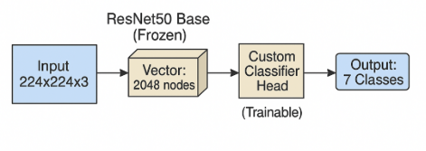
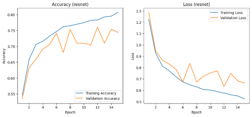
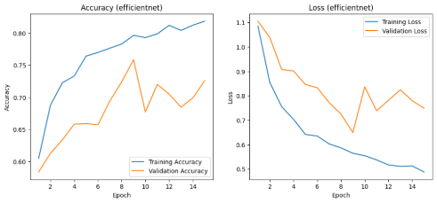

นี่คือข้อความที่คุณให้มา โดยแปลงเป็นรูปแบบ Markdown ครับ:

## การจำแนกประเภทตุ่มเเละรอยโรคผิวหนัง 7 ชนิด จากชุดข้อมูล HAM10000 โดยใช้ Transfer Learning และ Weighted Sampling

---

## ความสำคัญและความน่าสนใจ

ในการตรวจวินิจฉัยโรคประเภทตุ่มเเละรอยโรคผิวหนังเป็นหนึ่งในความท้าทายที่สำคัญอย่างยิ่งในวงการแพทย์ผิวหนังสมัยใหม่ เนื่องจากรอยโรคที่มีลักษณะภายนอกคล้ายคลึงกันอาจมีความรุนแรงแตกต่างกัน
การวินิจฉัยที่ล่าช้าโดยเฉพาะกับรอยโรคชนิด **เมลาโนมา (Melanoma)** สามารถส่งผลกระทบโดยตรงต่ออัตราการรอดชีวิตของผู้ป่วย (Esteva, et al. 2017, 115-118) ด้วยเหตุนี้สถาปัตยกรรม Deep Learning ประเภท **Convolutional Neural Networks (CNNs)** จึงได้เข้ามามีบทบาทสำคัญในฐานะเครื่องมือช่วยสนับสนุนการตัดสินใจทางการแพทย์ โดยมีความสามารถในการวิเคราะห์และจำแนกคุณลักษณะที่ซับซ้อนจากภาพถ่ายทางการแพทย์ได้อย่างแม่นยำ (Esteva, et al. 2017, 115-118)

อีกทั้งปัญหาของโปรเจกต์นี้ไม่ได้อยู่ที่การจำแนกภาพเพียงอย่างเดียว แต่แฝงอยู่ในลักษณะโครงสร้างของชุดข้อมูล **HAM10000** ซึ่งเป็นปัญหาที่เกิดขึ้นจริงในข้อมูลทางการแพทย์ นั่นคือปัญหา **ข้อมูลไม่สมดุล (Imbalanced Data)** (Tschandl, et al. 2018) โดยชุดข้อมูลนี้ประกอบด้วยคลาสส่วนใหญ่ เช่น **ไฝธรรมดา (nv)** ที่มีจำนวนข้อมูลหลายพันภาพ ในขณะที่คลาสส่วนน้อย ซึ่งเป็นคลาสที่มีความสำคัญทางการแพทย์สูงสุด เช่น **มะเร็งเมลาโนมา (mel)** หรือ **มะเร็งเบซัลเซลล์ (bcc)** กลับมีจำนวนข้อมูลเพียงหลักร้อยเท่านั้น (Tschandl, et al. 2018) ซึ่งความสำคัญในการแก้ไขปัญหานี้อยู่ที่การป้องกันไม่ให้โมเดลเกิด **Bias** หากโมเดลถูกฝึกแบบปกติ มันทายแต่คลาส nv เพื่อให้ได้ค่าความแม่นยำโดยรวมที่สูง ซึ่งจะส่งผลให้โมเดลไร้ประสิทธิภาพในการตรวจจับรอยโรคที่อันตรายและหายาก ซึ่งถือเป็นเป้าหมายหลักทางการแพทย์ที่แท้จริง

จากปัญหาดังกล่าว ผู้จัดทำจึงได้เล็งเห็นแนวทางในจัดการกับปัญหาข้อมูลไม่สมดุลนี้ และเพื่อบังคับให้โมเดลสนใจคลาสส่วนน้อยที่มีความสำคัญสูง ผู้จัดทำจึงไม่ได้ใช้แค่การสุ่มข้อมูลแบบมาตรฐาน แต่ได้เลือกใช้เทคนิค **Weighted Random Sampler** เป็นเครื่องมือหลักในการแก้ไขปัญหา ซึ่งเทคนิคนี้เป็นการปรับเปลี่ยนกระบวนการใน **Data Loader** โดยเราจะคำนวณ **Weight** ให้กับข้อมูลแต่ละชิ้นใน Training Set คือข้อมูลจากคลาสที่หายาก เช่น mel จะถูก **Oversampled** ให้ปรากฏในแต่ละ Batch บ่อยขึ้น ในขณะที่ข้อมูลจากคลาสส่วนใหญ่ เช่น nv จะถูก **Undersampled** และเหตุผลที่เราเลือกใช้เครื่องมือนี้ก็เพื่อบังคับให้โมเดลต้องเรียนรู้ Features ของคลาสที่หายากเหล่านั้น แทนที่จะเพิกเฉย ซึ่งจะช่วยเพิ่มประสิทธิภาพในการตรวจจับของรอยโรคอันตราย ซึ่งเป็นตัวชี้วัดความสำเร็จของโปรเจกต์นี้

---

## เหตุผลที่จำเป็นต้องใช้ deep learning ในการแก้ปัญหา

สำหรับปัญหาการจำแนกประเภทตุ่มเเละรอยโรคผิวหนัง (HAM10000) ซึ่งเป็นปัญหาการจำแนกประเภทจากรูปภาพที่มีความซับซ้อนสูง Deep Learning โดยเฉพาะโมเดล **Convolutional Neural Networks (CNNs)** ถือเป็นเครื่องมือที่เหมาะสมที่สุดในปัจจุบัน เมื่อเทียบกับวิธีการเรียนรู้ของเครื่องแบบ **Traditional Machine Learning**

### เปรียบเทียบกับวิธีอื่น ๆ

ซึ่งวิธีอื่นๆ ที่เราไม่ได้เลือกใช้ เช่น **Support Vector Machines**, **K-Nearest Neighbors**, หรือ **Random Forest** มีข้อจำกัดที่สำคัญที่สุดคือ **Manual Feature Extraction** ถ้าหากเราจะใช้ SVM ในการจำแนกภาพรอยโรค เราไม่สามารถป้อน Raw Pixels เข้าไปในโมเดลได้โดยตรง เราจำเป็นต้องให้ผู้เชี่ยวชาญ มาออกแบบและสกัด Features ของภาพออกมาก่อน

### จุดเด่นของ Deep Learning (CNNs) ที่ใช้ในโปรเจกต์

**Automatic Feature Extraction** เป็นจุดเด่นที่สำคัญที่สุด และเป็นเหตุผลหลักที่ต้องใช้โมเดล CNN เช่น **ResNet**, **EfficientNet** ที่โมเดลจะเรียนรู้คุณลักษณะเหล่านี้ได้เองโดยอัตโนมัติจากพิกเซลใน Layer แรก ๆ โดยจะเรียนรู้สิ่งง่ายๆ เช่น เส้นขอบ, จุดสี และชั้นที่ลึกขึ้นจะนำสิ่งเหล่านั้นมาประกอบกันเป็นคุณลักษณะที่ซับซ้อน เช่น พื้นผิวแบบตาข่ายที่พบบ่อยใน mel หรือ โครงสร้างแบบกิ่งไม้ที่พบบ่อยใน bcc (Esteva, et al. 2017, 115-118) โดยวิธีคือ เรานำโมเดล **ResNet50** หรือ **EfficientNet-B0** ที่ฉลาดอยู่แล้วมาใช้ จากนั้นเราทำการ **Freeze** ความรู้นั้นไว้ และสร้าง **New Head** เพื่อสอนให้มันรู้จักโรคผิวหนัง 7 ชนิดของเราเท่านั้น

### จุดด้อยของ Deep Learning (CNNs) ที่ใช้ในโปรเจกต์

โมเดล Deep Learning เช่น ResNet มีความซับซ้อนสูงมาก ทำให้ยากต่อการ **Interpretability** ว่าทำไมมันถึงตัดสินใจว่าภาพนี้เป็น mel มันอาจจะมองเห็นคุณลักษณะที่เราไม่รู้จัก
ถ้าหากเราไม่ใช้ **Transfer Learning** เช่นโมเดล **Custom CNN** ที่สร้างเอง โมเดลของเรามักจะมีประสิทธิภาพต่ำมาก

---

## สถาปัตยกรรม deep learning ที่ใช้

ในการทดลองนี้ สถาปัตยกรรมหลักที่ใช้คือ **Convolutional Neural Network (CNN)** ซึ่งเป็นสถาปัตยกรรมที่ถูกออกแบบมาเพื่อการประมวลผลข้อมูลเชิงพื้นที่โดยเฉพาะข้อมูลภาพ CNNs มีความสามารถโดดเด่นในการสกัด **Feature Extraction** ที่ซับซ้อนจากพิกเซลของภาพได้โดยอัตโนมัติ ทำให้เป็นเครื่องมือที่เหมาะสมที่สุดสำหรับปัญหาการจำแนกประเภทภาพทางการแพทย์ โครงการนี้ไม่ได้ใช้สถาปัตยกรรมประเภท **RNN (Recurrent Neural Network)** ซึ่งเหมาะกับข้อมูลอนุกรมเวลา (Sequential Data) หรือ **GAN (Generative Adversarial Network)** และ **VAE (Variational Autoencoder)** ซึ่งเหมาะกับงานสังเคราะห์หรือสร้างข้อมูลใหม่

การแสดงแผนภาพการเชื่อมต่อ, Neurons, Weights และค่า Biases ทั้งหมดของโมเดลที่ใช้ในการทดลองนี้ ประกอบไปด้วย **Custom CNN, ResNet50, EfficientNet-B0** ซึ่งเป็นไปไม่ได้ในทางปฏิบัติ เนื่องจากสถาปัตยกรรมเหล่านี้มีพารามิเตอร์ที่ต้องเรียนรู้หลายสิบล้านตัว อย่างไรก็ตามเราสามารถอธิบายสถาปัตยกรรมเชิงแนวคิด และส่วนประกอบหลักที่ใช้ในการทดลองเปรียบเทียบทั้ง 3 รูปแบบ ได้ดังนี้

### โมเดล Custom CNN

โมเดลแรกถูกสร้างขึ้นเพื่อใช้เป็น Baseline ในการวัดประสิทธิภาพ โดยเป็นโมเดล CNN ที่สร้างขึ้นเอง และมีสถาปัตยกรรมค่อนข้างตื้น ประกอบด้วย 2 ส่วนหลัก คือ

* **ส่วนสกัด Feature:** ประกอบไปด้วย Convolutional Blocks หลายชั้น โดยแต่ละ Block ประกอบด้วยชั้น Convolution สำหรับสกัดลักษณะเด่นของภาพ ตามด้วย ReLU เพื่อเพิ่มความไม่เชิงเส้นให้กับโมเดล และชั้น Max Pooling เพื่อย่อขนาดข้อมูลและคงเฉพาะลักษณะที่สำคัญที่สุดไว้
* **ส่วน Classifier:** ประกอบด้วย Fully Connected Layers โดยเริ่มจาก Flatten Layer เพื่อแปลงข้อมูลจากรูปแบบหลายมิติให้เป็นเวกเตอร์หนึ่งมิติ ตามด้วย Dense Layer และ ReLU เพื่อเรียนรู้รูปแบบเชิงซับซ้อน จากนั้นใช้ Dropout Layer เพื่อลดการเกิด overfitting และ Dense Layer สุดท้ายสำหรับการทำนายผลลัพธ์ของแต่ละคลาส

*ภาพที่ 1 แผนภาพเชิงแนวคิด Custom CNN*

### ResNet50

โมเดลนี้ใช้เทคนิค **Transfer Learning** โดยนำสถาปัตยกรรม **ResNet50** ซึ่งเป็นโมเดลที่ได้รับการพิสูจน์แล้วว่ามีประสิทธิภาพสูงในการจำแนกภาพจากชุดข้อมูล **ImageNet** (He, et al. 2016, 770-778) ResNet มีจุดเด่นคือการใช้ **Residual Connections** หรือ **Shortcut Connections** ที่ช่วยให้โมเดลสามารถเรียนรู้ในชั้นที่ลึกมากได้โดยไม่เกิดปัญหา **Gradient Degradation** (He, et al. 2016, 770-778) ในการทดลองนี้ เราใช้ ResNet50 ในรูปแบบดังนี้

* **Frozen:** โดยโหลดโมเดล ResNet50 ที่ Pre-train มาแล้ว และทำการ Freeze พารามิเตอร์ Weights และ Biases ทั้งหมดในส่วนนี้ เพื่อไม่ให้มีการอัปเดตระหว่างการฝึกใหม่
* **Trainable:** โดยเราตัดส่วน Classifier เดิมของ ResNet50 ทิ้งไป และสร้าง Head ใหม่ของเราเองขึ้นมาแทนที่ในชั้น Fully Connected โดยมีสถาปัตยกรรมดังนี้
    * `nn.Linear(in_features=2048, out_features=512)` คือทำการรับ 2048 Nodesจากชั้น Global Average Pooling ของ ResNet50
    * `nn.ReLU()` ใช้ ReLU เป็น Activation Function
    * `nn.Dropout(0.5)` ป้องกัน Overfitting
    * `nn.Linear(in_features=512, out_features=7)` ทำการส่งต่อไปยัง 7 โหนดสุดท้ายสำหรับ 7 คลาส

*ภาพที่ 2 แผนภาพเชิงแนวคิด ResNet50*

### EfficientNet-B0

โมเดลที่นี้ใช้หลักการ **Transfer Learning** เช่นเดียวกับ ResNet50 แต่เลือกใช้สถาปัตยกรรมที่ทันสมัยกว่าคือ **EfficientNet-B0** (Tan, MLe, Q. V 2019, 6105-6114) ซึ่งเป็นโมเดลที่ถูกออกแบบมาให้มีประสิทธิภาพสูง คือได้ Accuracy สูง ในขณะที่ใช้จำนวนพารามิเตอร์และทรัพยากรในการคำนวณน้อยกว่าโมเดลรุ่นเก่า (Tan, MLe, Q. V 2019, 6105-6114) การปรับใช้ EfficientNet-B0 มีแนวทางเดียวกับ ResNet50 คือ

* **Frozen:** โดยโหลดโมเดล EfficientNet-B0 ที่ Pre-train มาแล้ว และทำการ Freeze พารามิเตอร์ ทั้งหมดในส่วนนี้
* **Trainable:** ทำการแทนที่ส่วน classifier เดิมด้วย head ใหม่ที่ออกแบบเองเพื่อให้จำแนก 7 คลาส โดยรับ Input จากชั้น Global Average Pooling ที่มี 1280 โหนด
* **Activation Function:** EfficientNet ใช้ **SiLU** เป็น Activation Function หลักภายใน ซึ่งเป็นฟังก์ชันที่ Smooth และมีประสิทธิภาพสูงกว่า **ReLU**

*ภาพที่ 3 แผนภาพเชิงแนวคิด EfficientNet-B0*

---

## อธิบายโค้ด

### Download and Prepare Data

* **Cell 1:** ติดตั้ง Kaggle API จากนั้น download และ un-zip Dataset
* **Cell 2:** Plot graph เพื่อแสดงให้เห็นว่า Dataset มีความไม่สมดุล
* **Cell 3:** จัดการย้ายข้อมูลให้อยู่ใน Folder เดียว และจัด Folder Structure เพื่อให้ PyTorch โหลดข้อมูลได้

*ภาพที่ 4 การจัดการข้อมูลใน Folder (Cell 3)*

### Data pre-processing

* **Cell 1:** ตั้งค่า Global Parameter เช่น Batch size, Learning rate
* **Cell 2:** **get\_data\_loaders( )** เป็น function เตรียมข้อมูล ในส่วนของ `--- Transforms ---` เป็นการทำ **Data augmentation** เพื่อเพิ่มความหลากหลายของข้อมูลและลด Overfitting จากนั้นทำการโหลดข้อมูลจาก folder ด้วย `datasets.ImageFolder( )` จากนั้นทำ **Weighted Random Sampler** เพื่อแก้ปัญหา **Data Imbalance** ซึ่งจะทำให้ในแต่ละ Batch, DataLoader จะทำการสุ่มคลาสที่หายากบ่อยขึ้น และคลาสที่พบบ่อยน้อยลง

### Create Model

* **Cell 1:** ในส่วนแรก ทำการ define CNN model ที่เราสร้างเอง โดยใช้สถาปัตยกรรมตามข้อ 3.1 Custom CNN ในส่วนต่อมา function **create\_model( )** มี 3 โหมดให้เลือก คือ `custom`, `resnet`, `efficientnet`
    * **custom:** ใช้ **MyCustomCNN** ในการสร้าง model
    * **resnet:** ทำการโหลดโมเดล ResNet50 ที่ **pre-trained** มาแล้ว จากนั้นตั้งให้ **param.requires\_grad = False** เพื่อ **freeze parameter** ให้ไม่ถูกเทรน จากนั้นแทนที่ **model.fc** (ซึ่งเป็น classifier เดิม) ด้วยบล็อก fc ใหม่ **nn.Squential (Linear 2048 -> 512 -> 7)** จากนั้นตั้งค่า **Adam optimizer** ให้ train เฉพาะแค่ parameter ของบล็อกใหม่
    * **efficientnet:** ทำการโหลดโมเดล eddicientnet\_b0 ที่ pre-trained มาแล้ว จากนั้นตั้งให้ param.requires\_grad = False เพื่อ freeze parameter ให้ไม่ถูกเทรน จากนั้นแทนที่ model.classifier (ซึ่งเป็น classifier เดิม) ด้วยบล็อก fc ใหม่ nn.Squential (Linear 2048 -> 512 -> 7) จากนั้นตั้งค่า Adam optimizer ให้ train เฉพาะแค่ parameter ของบล็อกใหม่
    * จากนั้นตั้งค่า Loss funtion เป็น **Cross Entropy Loss**

### Train Model

* **Cell 1:** **train\_model( )** Function หลักสำหรับการ train model วนตามจำนวน epoch โดยทำตามวิธีปกติในการ train
    * `optimizer.zero_grad( )`: ล้าง Gradients เก่า
    * `outputs = model(inputs)`: Forward Pass
    * `loss = criterion( )`: คำนวณ Loss
    * `_, predicted = torch.max(outputs.data, 1)`: หา class ที่คะแนนสูงสุด
    * `loss.backward( )`: Backward Pass (คำนวณ Gradients)
    * `optimizer.step( )`: อัปเดต Weights
    * `running_loss += loss.item() * inputs.size(0)`: คำนวน Loss รวมของ batch เพื่อนำไปทำกราฟ
    * `correct_train += (predicted == labels).sum().item()`: นับจำนวนค่าที่ทายถูก
    * Evaluate model ด้วย validation set, เก็บค่า loss, accuracy เพื่อนำไปทำกราฟ
    * **evaluate\_model( )** ใช้สำหรับประเมิณ model บน validation set และพิมพ์ report
    * **plot\_histort( )** ใช้ในการ plot กราฟ accuracy และ loss ที่เราได้เก็บค่าไว้จาก train\_model
* **Cell 2:** เป็น script หลักสำหรับใช้รันการทดลองของ 3 โมเดล, ตั้งค่า Model ที่จะใช้ (custom, resnet, efficientnet) จากนั้นโหลด dataset, สร้างโมเดล, Train และพล็อตกราฟ

---

## อธิบายวิธีในการ train และ Dataset ที่ใช้

ในส่วนนี้จะเป็นการอธิบายถึงชุดข้อมูลที่ใช้, กระบวนการเตรียมข้อมูล, และการออกแบบการทดลองTrain และเปรียบเทียบโมเดล Deep Learning ทั้ง 3 สถาปัตยกรรม โดยเริ่มจาก

### Dataset และแหล่งที่มา

Dataset ที่ใช้ในการทดลองนี้คือ **HAM10000 (Human Against Machine with 10000 training images)** (Tschandl, et al. 2018) เป็น Dataset สาธารณะขนาดใหญ่ที่ได้รับการยอมรับ ในวงการวิจัย ประกอบด้วยภาพถ่ายรอยโรคผิวหนัง จำนวน 10,015 ภาพ ที่รวบรวมจากหลายแหล่งที่มา เช่น ออสเตรเลีย และ ออสเตรีย

ชุดข้อมูลนี้ประกอบด้วยรอยโรค 7 ประเภท ที่มีความสำคัญทางการแพทย์แตกต่างกัน ดังนี้

* โรคผิวหนังจากแสงแดด (Actinic keratoses - **akiec**)
* มะเร็งเบซัลเซลล์ (Basal cell carcinoma - **bcc**)
* ตุ่มคล้ายเนื้องอกเคอราโตซิส (Benign keratosis-like lesions - **bkl**)
* เนื้องอกผิวหนัง (Dermatofibroma - **df**)
* มะเร็งเมลาโนมา (Melanoma - **mel**)
* ไฝ (Melanocytic - **nv**)
* รอยโรคหลอดเลือด (Vascular lesions - **vasc**)

*ภาพที่ 5 กราฟแสดงจำนวนของแต่ละคลาส*

จากที่ได้กล่าวไว้ในบทนำ ชุดข้อมูลนี้มีปัญหา **Imbalanced Data** อย่างรุนแรง โดยคลาส **nv** มีจำนวนมากถึง 6,705 ภาพ ในขณะที่คลาสที่หายากที่สุดเช่น **df** มีเพียง 115 ภาพ และคลาสที่อันตรายที่สุดอย่าง **mel** ก็มีเพียง 1,113 ภาพ (Tschandl, et al. 2018)

### Data Preprocessing

ก่อนขั้นตอนการ train model ผู้จัดทำได้ดำเนินกระบวนการเตรียมข้อมูลดังต่อไปนี้

#### การแบ่งข้อมูล (Data Split)

* จากชุดข้อมูลทั้งหมด 10,015 ภาพ ได้ถูกแบ่งออกเป็น 2 ส่วน คือ **Training Set** จำนวณ 80% หรือ 8,012 ภาพ และ **Validation Set** จำนวณ 20% หรือ 2,003 ภาพ

#### Stratified Split

* ใช้วิธีการแบ่งแบบ Stratified เพื่อให้แน่ใจว่าสัดส่วนเปอร์เซ็นต์ของคลาสที่หายาก เช่น mel, df ในชุด Training และ Validation ยังเท่ากันกับชุดข้อมูลเดิม ซึ่งจำเป็นต่อการประเมินโมเดลที่แก้ปัญหา Imbalance

#### การจัดเรียงไฟล์

* ในส่วนของข้อมูลที่แบ่งแล้วจะถูกจัดเรียงใหม่ลงในโครงสร้างโฟลเดอร์ที่ `torchvision.datasets.ImageFolder` สามารถอ่านได้ เช่น `train/mel`, `val/mel`

### การออกแบบการทดลอง (Experimental Design)

เพื่อเปรียบเทียบประสิทธิภาพของสถาปัตยกรรมทั้ง 3 รูปแบบ คือ **Custom CNN, ResNet50, EfficientNet-B0** เราได้ออกแบบการทดลองโดยกำหนด **Constants** ทั้งหมดให้เหมือนกัน ดังนี้

* **Data Augmentation:** โดยข้อมูลใน Training Set ถูกเพิ่มปริมาณโดยใช้ transforms ชุดเดียวกัน คือ
    * Resize โดยปรับขนาดภาพทั้งหมดเป็น 224x224 พิกเซล
    * RandomHorizontalFlip ทำการสุ่มพลิกภาพในแนวนอน
    * RandomRotation ทำการสุ่มหมุนภาพ
    * ทำการแปลงภาพเป็น Tensor และ Normalize ค่าสีด้วย Mean/Std ของ ImageNet
* **Imbalance Handling:** โดยโมเดลทั้งสามใช้ **WeightedRandomSampler** ใน DataLoader ของ Training Set เพื่อทำโมเดลเห็นคลาสที่หายาก เช่น mel, df บ่อยขึ้น และเห็นคลาส nv น้อยลง
* **Loss Function:** โดย **nn.CrossEntropyLoss** ถูกใช้เป็นฟังก์ชันสูญเสียสำหรับทุกโมเดล
* **Adam Optimizer (lr=0.001)** ถูกใช้เป็นตัวปรับค่า Weight
* **Training Epochs:** ในทุกโมเดลถูกฝึกเป็นเวลา **15 Epochs** เท่ากัน

ในการทดลองนี้มีสถาปัตยกรรมโมเดลเป็นตัว Independent Variable เพื่อวัดผลลัพธ์ เช่น Accuracy และ Recall ที่เกิดขึ้น

---

## อธิบายการประเมิน (evaluate) model

ผู้จัดทำได้ทำการประเมินประสิทธิภาพของโมเดลทั้ง 3 สถาปัตยกรรม โดยวิเคราะห์จาก Metric ที่เหมาะสมกับปัญหา และพิจารณากราฟการฝึกโมเดล

### Metric ที่เหมาะสมในการประเมิน

สำหรับปัญหา **Imbalanced Data** เช่นชุดข้อมูล **HAM10000** นี้การใช้ค่า **Accuracy** อย่างเดียวในการวัดผลอาจจะทำให้ได้ข้อสรุปที่ผิดพลาด

และปัญหาของ Accuracy คือชุดข้อมูลนี้มีคลาส **nv** มากถึง ~67% ถ้าหากโมเดลเรียนรู้ที่จะทาย nv ตลอดก็จะได้ Accuracy สูงถึง 67% แต่ก็จะไม่มีประโยชน์เลยเพราะไม่สามารถตรวจจับมะเร็ง **mel** ได้เลย

เพราะเหตุนี้เราจึงต้องใช้ Metric ที่เหมาะสมกว่าในการประเมินโมเดล

#### Recall

> Recall = True Positives / (True Positives + False Negatives)

ส่วนนี้เป็น **Metric ที่สำคัญที่สุด** สำหรับปัญหาทางการแพทย์นี้ ซึ่งหมายความว่ารอยโรคที่เป็น mel ทั้งหมด โมเดลของเราสามารถตรวจเจอ True Positives ได้กี่เปอร์เซ็นต์ ในกรณีที่ค่า Recall สูงหมายถึง โมเดลมี **False Negatives** ต่ำซึ่งเป็นสิ่งที่เราต้องการมากที่สุด

#### Precision

> Precision = True Positives / (True Positives + False Positives)

หมายความว่า ในสิ่งที่โมเดลทายว่าเป็น mel ทั้งหมด จริง ๆ แล้วมีกี่เปอร์เซ็นต์ที่เป็น mel โดย
การที่ค่า Precision ต่ำหมายถึงโมเดลมี **False Positives** สูง

#### F1-Score

เป็นค่าเฉลี่ยแบบฮาร์มอนิกของ Precision และ Recall

#### Macro Avg (F1-Score)

ทำการคำนวณ F1-Score ของแต่ละคลาส แล้วนำมาเฉลี่ยโดยไม่ถ่วงน้ำหนัก ซึ่งเป็นตัวชี้วัดที่ดีว่าโมเดลเก่งทุกคลาสหรือไม่ ต่อให้เป็นคลาสที่หายาก

### Training & Validation Curves

ในกระบวนการฝึกโมเดล ได้ทำการบันทึกค่า Loss และค่า Accuracy ของ Training Set และValidation Set เพื่อตรวจสอบพฤติกรรมของการเรียนรู้ของโมเดล

#### Accuracy และ Loss ของโมเดล Custom

*ภาพที่ 6 กราฟแสดง Accuracy และ Loss ของโมเดล Custom*

จากกราฟ Accuracy จะเห็นได้ว่า ค่า Training Accuracy มีแนวโน้มเพิ่มขึ้นอย่างต่อเนื่องจากประมาณ 0.38 ในช่วงเริ่มต้นจนถึงประมาณ 0.83 แสดงให้เห็นว่าโมเดลสามารถเรียนรู้คุณลักษณะของข้อมูลได้ดีขึ้นเรื่อย ๆ ส่วนค่า Validation Accuracy มีแนวโน้มเพิ่มขึ้นในช่วงต้นและคงที่อยู่ในช่วงประมาณ 0.60–0.68
ซึ่งบ่งบอกว่าโมเดลสามารถจำแนกข้อมูลที่ไม่เคยเห็นมาก่อนได้ในระดับที่น่าพอใจ

ในส่วนของกราฟ Loss พบว่าค่า Training Loss ลดลงอย่างต่อเนื่องจากประมาณ 1.6 เหลือเพียง 0.5 ในขณะที่ค่า Validation Loss ลดลงในช่วงต้นและคงที่อยู่ในช่วงประมาณ 0.9–1.0 ตลอดการฝึก ซึ่งแสดงให้เห็นว่าโมเดลมีการเรียนรู้ที่มีเสถียรภาพและไม่เกิดการ overfitting อย่างรุนแรง

โดยสรุป ผลการเรียนรู้จากกราฟ Accuracy และ Loss แสดงให้เห็นว่าโมเดล Custom สามารถเรียนรู้ได้อย่างมีประสิทธิภาพ และมีแนวโน้มให้ผลลัพธ์ที่ดีในการจำแนกภาพผิวหนัง โดยยังสามารถปรับปรุงเพิ่มเติมได้เพื่อเพิ่มความแม่นยำในชุดข้อมูลทดสอบต่อไป

#### Accuracy และ Loss ของโมเดล ResNet50

*ภาพที่ 7 กราฟแสดง Accuracy และ Loss ของโมเดล ResNet50*

จากกราฟ Accuracy ของชุดข้อมูลฝึกมีแนวโน้มเพิ่มขึ้นอย่างต่อเนื่องตลอดช่วงการฝึก และมีค่าที่สูงกว่า Validation Accuracy ในทุกช่วง แสดงให้เห็นว่าโมเดลสามารถเรียนรู้คุณลักษณะของข้อมูลได้ดี และไม่มีการเกิด Overfitting อย่างรุนแรง เนื่องจากเส้นของ Accuracy ทั้งสองอยู่ใกล้เคียงกัน โดยค่าความแม่นยำสูงสุดของชุดตรวจสอบอยู่ที่ประมาณ 0.75 ซึ่งถือว่ามีสมรรถนะที่ดีในงานจำแนกภาพมะเร็งผิวหนังหลายคลาส

ในส่วนของกราฟ Loss พบว่าค่าของ Training Loss และ Validation Loss ลดลงอย่างชัดเจนในช่วงแรกของการฝึก ใน Epoch 1–5 และค่อย ๆ ลดลงต่อเนื่องจนเข้าสู่ค่าคงที่ในช่วง Epoch หลัง ๆ ซึ่งบอกถึงการเรียนรู้ที่มีเสถียรภาพของโมเดล

โดยสรุป ผลการเรียนรู้ของโมเดล ResNet50 แสดงให้เห็นว่า โมเดลมีแนวโน้มการปรับปรุงสมรรถนะอย่างต่อเนื่องระหว่างการฝึก สามารถลดค่าความสูญเสียและเพิ่มค่าความแม่นยำได้อย่างมีประสิทธิภาพ แสดงถึงการเรียนรู้ที่เหมาะสมและมีการปรับพารามิเตอร์ได้อย่างเสถียร และเมื่อเปรียบเทียบกับโมเดลอื่น
จะเห็นได้ว่า ResNet50 ให้สมรรถนะโดยรวมสูงสุดในด้าน Accuracy และมีค่า Loss ที่ลดลงได้ต่อเนื่องที่สุด

#### Accuracy และ Loss ของโมเดล EfficientNet-B0

*ภาพที่ 8 กราฟแสดง Accuracy และ Loss ของโมเดล EfficientNet-B0*

จากกราฟ Accuracy ของทั้งชุดฝึกและชุดตรวจสอบเพิ่มขึ้นอย่างต่อเนื่องในช่วงเริ่มต้นของการฝึก
ใน Epoch 1–8 และค่อย ๆ ทรงตัวเมื่อถึงช่วงท้ายของการฝึก ซึ่งแสดงให้เห็นว่าโมเดลสามารถเรียนรู้คุณลักษณะของข้อมูลได้อย่างมีประสิทธิภาพ และค่า Validation Accuracy มีแนวโน้มใกล้เคียงกับ Training Accuracy ตลอดกระบวนการ แสดงถึงการเกิด Overfitting ในระดับต่ำ และสะท้อนถึง Generalization ของโมเดลได้ดี โดยมีค่าความแม่นยำสูงสุดประมาณ 0.72–0.75

ส่วนกราฟ Loss ในแต่ละ Epoch พบว่าค่าของ Training Loss และ Validation Loss ลดลงอย่างต่อเนื่อง โดยเฉพาะในช่วงแรกของการฝึก ที่ Epoch 1–5 ซึ่งบอกถึงการเรียนรู้ที่รวดเร็วและมีเสถียรภาพ เมื่อเข้าสู่ช่วง Epoch หลัง ๆ ค่าการสูญเสียมีแนวโน้มคงที่ โดยค่า Validation Loss สูงกว่า Training Loss

โดยสรุป คือโมเดล EfficientNet-B0 แสดงให้เห็นถึงการเรียนรู้ที่มีประสิทธิภาพและเสถียร ไม่มีแนวโน้ม Overfitting อย่างมีนัยสำคัญ สามารถรักษาความสมดุลระหว่าง Accuracy และ Loss ได้ดี ซึ่งโมเดล EfficientNet-B0 ให้ค่า F1-Score (Macro Avg) สูงสุดในบรรดาโมเดลที่ทำการเปรียบเทียบทั้งหมด

### Model Classification Results and Confusion Matrix Analysis

#### Confusion Matrix ของโมเดล Custom

*ภาพที่ 9 แผนภาพ Confusion Matrix ของโมเดล Custom*

จากผลการทดสอบพบว่า แบบจำลองสามารถจำแนกกลุ่ม nv ได้ถูกต้องมากที่สุด จำนวน 910 รายการ ขณะที่กลุ่ม mel และ bkl มีการจำแนกถูกต้องรองลงมา คือ 141 และ 116 รายการ ตามลำดับ
และยังพบการจำแนกผิดระหว่างบางกลุ่ม เช่น bkl และ nv ซึ่งมีลักษณะภาพคล้ายกัน ส่งผลให้แบบจำลองแยกแยะได้ยากในบางกรณี

โดยรวมแล้ว ผลลัพธ์จาก Confusion Matrix แสดงให้เห็นว่าแบบจำลองมีประสิทธิภาพในระดับที่น่าพอใจ แต่ยังสามารถปรับปรุงเพิ่มเติมเพื่อเพิ่มความแม่นยำในการจำแนกบางกลุ่มได้ต่อไป

#### Confusion Matrix ของโมเดล ResNet50

*ภาพที่ 10 แผนภาพ Confusion Matrix ของโมเดล ResNet50*

จากภาพแสดง Confusion Matrix ของโมเดล ResNet50 ซึ่งใช้ในการประเมินสมรรถนะของโมเดลในการจำแนกภาพผิวหนังออกเป็น 7 ประเภท โดยแผนภาพนี้แสดงให้เห็นจำนวนภาพที่โมเดลทำนายได้ถูกต้องและผิดพลาดในแต่ละคลาส โดยแกนแนวนอน หมายถึงค่าที่โมเดลทำนาย ส่วนแกนแนวตั้ง หมายถึงค่าคำตอบจริงจากชุดข้อมูลทดสอบ

จากผลในภาพ โมเดลสามารถจำแนกภาพในคลาส nv ได้อย่างแม่นยำสูงสุด โดยมีจำนวนภาพที่ทำนายถูกต้อง 1,061 ภาพ ซึ่งเป็นกลุ่มที่มีจำนวนข้อมูลมากที่สุดในชุดข้อมูล ส่งผลให้โมเดลเรียนรู้ลักษณะของกลุ่มนี้ได้ดี นอกจากนี้ คลาส bkl และ mel ก็มีผลการจำแนกที่อยู่ในระดับดี สะท้อนถึงความสามารถของโมเดลในการจำแนกโรคที่มีลักษณะภาพแตกต่างกัน

และจากผลในภาพ พบการสับสนบางส่วนระหว่างคลาส mel และ nv รวมถึง bkl และ bcc เนื่องจากลักษณะภาพมีความใกล้เคียงกันสูง และคลาสที่มีจำนวนตัวอย่างน้อย เช่น df และ vasc มีแนวโน้มถูกจำแนกผิดบ้าง เนื่องจากข้อมูลมีจำกัด ทำให้โมเดลเรียนรู้ได้ไม่ครอบคลุม

#### Confusion Matrix ของโมเดล EfficientNet-B0

*ภาพที่ 11 แผนภาพ Confusion Matrix ของโมเดล EfficientNet-B0*

จากผลในภาพพบว่า แบบจำลองสามารถจำแนกข้อมูลในกลุ่ม nv ได้อย่างแม่นยำมากที่สุด โดยมีจำนวนการทำนายถูกต้อง 910 รายการ จากจำนวนข้อมูลจริงทั้งหมดในกลุ่มดังกล่าว ซึ่งถือเป็นกลุ่มที่มีปริมาณข้อมูลมากที่สุดในชุดข้อมูลทดลอง และในกลุ่ม mel และ bkl ก็สามารถจำแนกได้ในระดับที่น่าพอใจ โดยมีค่าทำนายถูกต้อง 141 และ 116 รายการตามลำดับ

และยังพบการจำแนกผิดระหว่างบางกลุ่ม เช่น กลุ่ม bkl ถูกจำแนกเป็น nv และ mel ในบางกรณี รวมถึงกลุ่ม bcc และ akiec ที่มีการจำแนกผิดพลาดค่อนข้างสูง เนื่องจากลักษณะภาพของกลุ่มเหล่านี้มีความคล้ายคลึงกันในเชิงลักษณะผิวหนัง ทำให้แบบจำลองแยกแยะได้ยาก

โดยสรุป Confusion Matrix ดังกล่าวช่วยแสดงให้เห็นถึงความสามารถและข้อจำกัดของแบบจำลอง ในการจำแนกภาพผิวหนังแต่ละประเภทได้อย่างชัดเจน ซึ่งสามารถนำไปใช้เป็นข้อมูลพื้นฐานในการปรับปรุงแบบจำลองให้มีความแม่นยำสูงขึ้นในขั้นตอนต่อไป

### ผลลัพธ์การประเมินโมเดล (Model Evaluation Results)

*ตารางที่ 1 ผลการประเมินสมรรถนะของโมเดลจำแนกมะเร็งผิวหนัง*

| Metric | Custom CNN (Baseline) | ResNet50 | EfficientNet-B0 (ProposedWinner) |
| :--- | :--- | :--- | :--- |
| **Overall Accuracy** | 0.6425 | **0.7439** | 0.7259 |
| **F1-Score (Macro Avg)** | 0.5092 | 0.6172 | **0.6403** |
| **F1-Score (Weighted Avg)** | 0.6763 | **0.7612** | 0.7462 |
| **Recall (mel)** | **0.6323** | 0.5426 | 0.5426 |
| **Precision (mel)** | 0.3190 | 0.4416 | 0.4144 |
| **Recall (df)** | 0.5652 | 0.6087 | **0.6957** |
| **Precision (df)** | 0.2708 | 0.4375 | **0.6667** |
| **Training Time (per epoch)** | 100 s | 105 s | **94 s** |
| **Overfitting** | High | Medium | **Low** |

จากการวิเคราะห์ผลลัพธ์ในตารางพบว่า โมเดล **ResNet50** ให้ค่า **Overall Accuracy สูงสุด (0.7439)** และมี **F1-Score (Weighted Avg) สูงที่สุด (0.7612)** ซึ่งแสดงให้เห็นประสิทธิภาพที่ดีในการจัดการกับคลาสส่วนใหญ่ เช่น nv และโมเดล **EfficientNet-B0** ก็ให้ค่า **F1-Score (Macro Avg) ที่ดีที่สุด (0.6403)** ซึ่งชี้ให้เห็นว่า EfficientNet-B0 เป็นโมเดลที่มี Balance ที่สุดในการจำแนก Minority Classes ได้อย่างเท่าเทียมกัน

และในส่วนของโมเดล **Custom CNN (Baseline)** ถึงจะเป็นโมเดลที่ประสิทธิภาพโดยรวมต่ำที่สุด แต่กลับมีค่า **Recall ของคลาส mel สูงที่สุด (0.6323)** ค่า Recall ที่สูงนี้ ไม่ได้หมายความว่าโมเดลมีความแม่นยำ แต่เป็นผลลัพธ์ที่เกิดจากความผิดพลาด เมื่อวิเคราะห์ Confusion Matrix พบว่าโมเดล Custom CNN ได้ทายผิดโดยจำแนก nv ไปเป็น mel มากถึง 250 กรณี การที่โมเดล ทาย nv เป็น mel ผิดบ่อยจึงทำให้ค่า Recall ของ mel สูงขึ้นในทางสถิติ แต่ก็ฉุดให้ค่า **Precision (0.3190) ต่ำที่สุด** ซึ่งทำให้เห็นว่าโมเดลนี้มี **False Positives สูง**

### Model Performance Matrix
Custom CNN			
| Class	| Precision	| Recall	| F1-Score | 
| :--- | :--- | :--- | :--- |
| akiec	| 0.3182	| 	0.5385	| 	0.4 | 
| bcc	| 	0.4907	| 	0.5146	| 	0.5024	| 
| bkl	| 	0.3932	| 	0.5273	| 	0.4505	| 
| df	| 	0.2708	| 	0.5652	| 	0.3662	| 
| mel	| 	0.319	| 	0.6323	| 	0.4241	| 
| nv	| 	0.9401	| 	0.6786	| 	0.7882	| 
| vasc	| 	0.5938	| 	0.6786	| 	0.6333	| 
| accuracy	| 	| 			| 0.6425	| 
| macro avg	| 	0.4751	| 	0.5907	| 	0.5092	| 
| weighted avg	| 	0.7551	| 	0.6425	| 	0.6763	| 

---

## บทความอ้างอิงและงานที่เกี่ยวข้อง

* Esteva, A., Kuprel, B., Novoa, R. A., Ko, J., Swetter, S. M., Blau, H. M., & Thrun, S.
    (2017). Dermatologist-level classification of skin cancer with deep neural
    networks. *Nature*, *542*(7639), 115-118.
* He, K., Zhang, X., Ren, S., & Sun, J. (2016). Deep residual learning for image recognition.
    *Proceedings of the IEEE Conference on Computer Vision and Pattern Recognition (CVPR)*, 770–778. Las Vegas, NV: IEEE.
* Tan, M., & Le, Q. V. (2019). EfficientNet: Rethinking model scaling for convolutional neural networks. *Proceedings of the 36th International Conference on Machine Learning (ICML)*, 6105–6114. International Machine Learning Society.
* Tschandl, P., Rosendahl, C., & Kittler, H. (2018). The HAM10000 dataset, a large
    collection of multi-source dermatoscopic images of common pigmented skin lesions. *Scientific Data*, *5*, 180161.

---

## สมาชิกผู้จัดทำ และสัดส่วนและการแบ่งหน้าที่ความรับผิดชอบ

ในช่วงแรกของการพัฒนาโครงงาน เราทั้งคู่ได้เริ่มต้นแนวคิดในการสร้างโมเดลสังเคราะห์ดนตรี (**Music Synthesis**) โดยมีเป้าหมายเพื่อผสมผสานแนวดนตรีที่แตกต่างกันอย่างดนตรีคลาสสิก อย่างโมสาร์ท และดนตรีพื้นบ้าน อย่างหมอลำ ซึ่งในระหว่างการพัฒนาต้นแบบเราได้พบกับข้อจำกัดทางเทคนิคที่สำคัญ โดยเฉพาะปัญหา **Spectrogram processing** ซึ่งส่งผลให้เสียงที่สังเคราะห์ออกมาขาดความชัดเจนและมีสัญญาณรบกวนสูง

ด้วยเหตุนี้ เราทั้งคู่จึงได้ปรึกษากันและตัดสินใจเปลี่ยนแนวทาง เพื่อประยุกต์ใช้ Deep Learning ในการแก้ปัญหาในด้านอื่น หลังจากการค้นคว้าและพัฒนาร่วมกัน เราจึงได้ข้อสรุปในการพัฒนาโครงงาน ที่ชื่อว่าการจำแนกประเภทตุ่มเเละรอยโรคผิวหนัง 7 ชนิด จากชุดข้อมูล HAM10000 ในโครงงานใหม่นี้ ผมทั้งคู่ได้ร่วมกันออกแบบการทดลอง ประยุกต์ใช้เทคนิค **Transfer Learning** โดยเปรียบเทียบสถาปัตยกรรม **Custom CNN, ResNet50 และ EfficientNet-B0** ควบคู่ไปกับการใช้ **Weighted Sampling** เพื่อจัดการกับปัญหา **Imbalanced Data** จนกระทั่งได้ผลลัพธ์การทดลองออกมาเป็นที่น่าพอใจ

หลังจากนั้น เราทั้งคู่ได้ร่วมกันวิเคราะห์ผลลัพธ์ และจัดทำรายงานฉบับนี้ โดยมีการพูดคุยแลกเปลี่ยนความคิดเห็นในทุกหัวข้อ และทุกส่วนของรายงานอยู่ตลอด

โดยสรุป เนื่องจากทุกกระบวนการ ตั้งแต่การพูดคุยแลกเปลี่ยน และรวบรวมความคิด, การแก้ปัญหาทางเทคนิค, การพัฒนาและทดลองโมเดล, และการจัดทำรายงาน เป็นการทำงานร่วมกันในทุก ๆ ส่วนผู้จัดทำจึงสรุปสัดส่วนของงานทั้งหมดออกเป็นดังนี้

* 6814500949 นายศุภกฤต วัฒนศรี = **50%**
* 6814500922 นายปัญจพล บานเพียร = **50%**